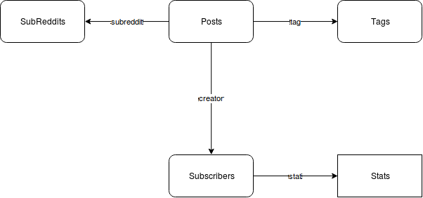

# Reference-Fetcher

ReferenceFetcher is a simple-to-use JS library to fetch entity reference with a configuration object.

[](https://travis-ci.org/wing-eu/reference-fetcher/) [](https://github.com/lucmerceron/reference-fetcher/releases) [](https://codecov.io/gh/wing-eu/reference-fetcher)

## Installation

```
npm install --save reference-fetcher
```

## Documentation

ReferenceFetcher is an algorithm useful for retrieving multiple referenced entity from a database.

Imagine we have this kind of database:



Posts is the key database table here. A post has 3 references; a tag, a creator and a subreddit which correspond to IDs that we can find in the corresponding database tables.

**Note:** ReferenceFetcher is made to work with only unique references up to now, do not use it to fetch an array of reference (i.e. a Post should have only **one** tag, **one** creator and **one** subreddit in our example). Array may come as a feature in the near future.

Our workflow is to get a particular set of Posts (to feed a page or whatever) and its references but we do not want the Back-End to populate them for us for three reasons:
 1. This could create a massive request that take times to compute with a considerable payload (hurting our [First Meaningful Paint](https://developers.google.com/web/tools/lighthouse/audits/first-meaningful-paint) time).
 2. It will probably contains duplication of the same entity (multiple posts can have the same creator, tag or subreddit). 
 3. We usually prefer to keep our Front-End stores as flat as possible. Using deeply nested data is often very difficult to use in JavaScript applications, especially for those using [Flux](http://facebook.github.io/flux/) or [Redux](http://redux.js.org/)
 
That's where ReferenceFetcher shines. Thanks to a configuration object, we can declare what references we want to fetch and it will call our Promises with the correct parameters plus taking care of duplication. Then it is up to us to populate correctly our store with our Promises results. At Wing we use Redux dispatch from our Promises (which are actions) result to populate our stores. Promises must **always** returns their results after the operation you have done.

```javascript
import referenceFetcher from 'reference-fetcher'

const configuration = {
  entity: 'posts',
  func: () => getPosts(),
  refs: [{
    entity: 'subreddit',
    func: subredditId => getSubreddit(subredditId),
  }, {
    entity: 'subscribers',
    relationName: 'creator',
    batch: true,
    func: subscribersIds => getSubscribers(subscribersIds),
    refs: [{
      entity: 'stats',
      relationName: 'stat',
      batch: true,
      func: getStats,
    }]
  }, {
    entity: 'tag',
    noCache: true,
    func: getTag,
  }]
}

referenceFetcher(configuration)
```

Example of actions used:

```javascript
const getPosts = () => new Promise((resolve, reject) => {
  // Retrieve posts from your api
  fetch(`${APIURL}/posts`).then(response => {
    // Populate your store
    postsStore.push(...response.posts)
    // Return the response allowing to fetch underneath references
    // and chain our promise
    return response
  })
})
const getSubreddit = subredditId => new Promise((resolve, reject) => {
  fetch(`${APIURL}/subreddits/${subredditId}`).then(response => {
    subredditsStore.push(response.subreddit)
    return response
  })
})
const getSubscribers = subscribersId => new Promise((resolve, reject) => {
  // A POST method to get a batch of subscribers, because you can
  fetch(`${APIURL}/subscribers`, {
    method: 'POST',
    body: subscribersId
  }).then(response => {
    subscribersStore.push(...response.subscribers)
    return response
  })
})
```

### Arguments
* entity (String): The name that will be used to retrieve data from the Promise result. These data will then be used to retrieve our underneath refs. Omit this argument if your API response contains directly the desired result.
* func (Promise): The Promise that will be called to get our particular `entity`. func is called with no parameters if it is the root Object (`Post` in our example) or is called multiple times with  a `String` representing the ID to fetch (`getSubreddit` in our example) or is called once with an `Array` of ID to fetch (`getSubscribers` in our example). **The promise must return its results if we want lower refs to work.**
* relationName (String): *Only for refs*  The name of the attribute in the parent object where we can find the ID to fetch. Default to `entity`.
* batch (Boolean): *Only for refs* Default value: false. Set to true if you want your `func`called only once with the array of ID to retrieve.
* noCache (Boolean): *Only for refs* Default value: false. Set to true if you want to bypass the already fetched watcher. It means that if the entity we want to retrieve was already retrieved earlier, ReferenceFetcher will still call our `func` with the unique IDs it finds in the parent `Object`.

### Returns
ReferenceFetcher returns nothing, its objective is only to correctly call the different Promises. We need to feed our store directly from the Promises.

## Change Log
This project adheres to [Semantic Versioning](http://semver.org/).

You can find every release documented on the [Releases](https://github.com/wing-eu/reference-fetcher/releases) page.

## License
MIT